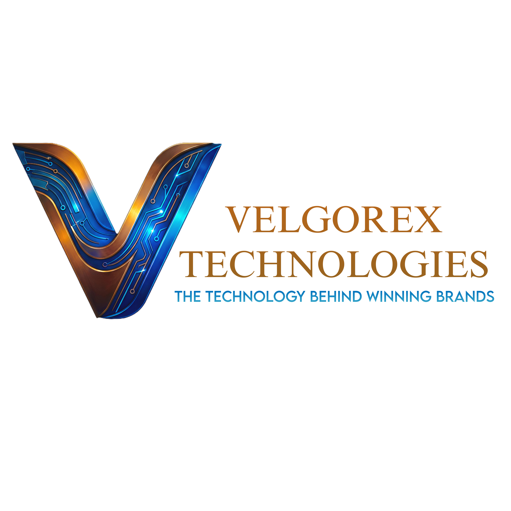

# Velgorex Technologies Website
### Website Live: www.velgorex.com
A premium, cinematic portfolio website developed for **Velgorex Technologies**.

---

## About the Project

This project is a high-end, scroll-driven website created to represent the brand identity and technical capabilities of Velgorex Technologies.

The goal of this website is to:
- establish a strong digital presence  
- communicate premium quality and technical expertise  
- convert visitors into potential clients  

---

## Project Objective

To design and develop a modern, high-performance website that:

- showcases Velgorex as a premium technology partner  
- highlights services in a clear and impactful way  
- provides a seamless and engaging user experience  
- drives business inquiries through optimized conversion flow  

---

## Key Features

- Cinematic scroll-based user experience  
- Smooth animations powered by GSAP (ScrollTrigger)  
- Developer-focused storytelling (Code → System → Product)  
- Premium UI design using Electric Blue & Metallic Gold palette  
- Fully responsive across all devices  
- Integrated contact system with email functionality  
- SEO-optimized structure and content  

---

## Services Represented

- Website Development  
- Mobile App Development  
- Business Automation Systems  
- Custom Software Solutions  

---

## Tech Stack

- React  
- TypeScript  
- GSAP (ScrollTrigger)  
- React Three Fiber (WebGL)  
- Tailwind CSS  
- Node.js (Backend)  
- Resend (Email Integration)  

---

## 📩 Contact (Client)

Velgorex Technologies  
📧 admin@velgorex.com  

---

##  Development Notes

This project focuses on combining:
- modern UI/UX principles  
- cinematic motion design  
- performance-driven development  

to deliver a high-quality digital experience aligned with a premium brand.

---

## Status

Completed and deployed.  
Further enhancements and optimizations can be added based on business needs.

---

##  Note

This website is developed as a custom solution tailored specifically for Velgorex Technologies, with a strong focus on design quality, performance, and business impact.
